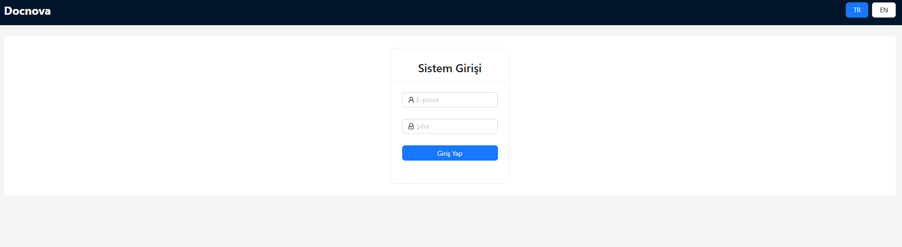
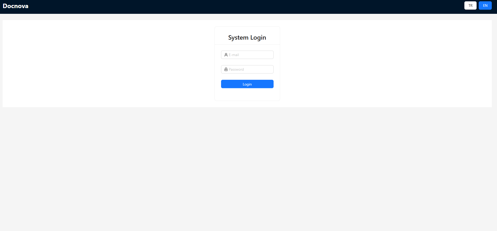
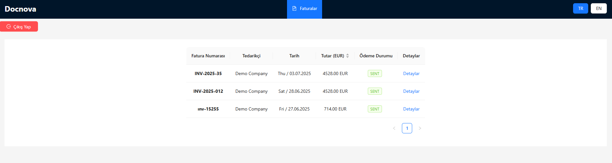
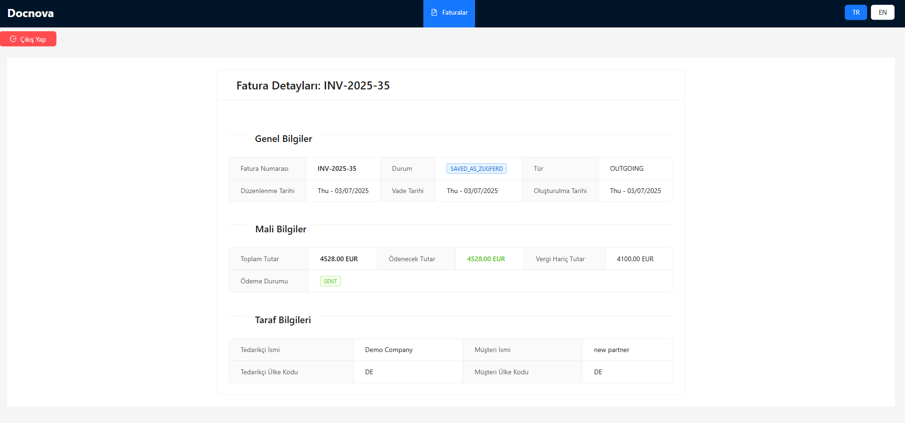
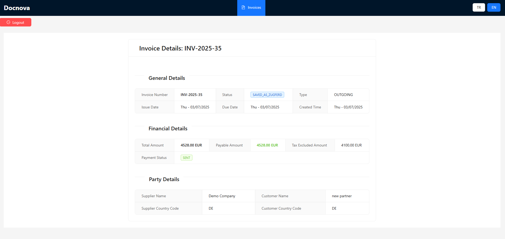

# DocNova
App for listing bills. Built by Vite, React, JS

## Tech Stack
* React
* JavaScript
* Vite
* Redux Toolkit
* Ant-Design
* i18next
* React Router
* dayjs

## Features
* Bill list and detail page
* REST API integration
* Global state management via Redux
* Multiple language suppor via i18next
* Responsive design by using Ant-Design
* Route protection

## Requirements
* Node.js
* npm veya yarn

## Installation
```
git clone <repository-url>
npm install
npm run dev
```

## Extra
* Please update vite.config.js file as following for CORS
```
export default defineConfig({
  plugins: [react()],
  server: {
    proxy: {
      "/api": {
        target: "https://api-dev.docnova.ai",
        changeOrigin: true,
        secure: false,
        rewrite: (path) => path.replace(/^\/api/, ""),
        configure: (proxy) => proxy.on("proxyReq", (req) => req.removeHeader("origin")),
      }
    }
  }
})
```

## Demo:






